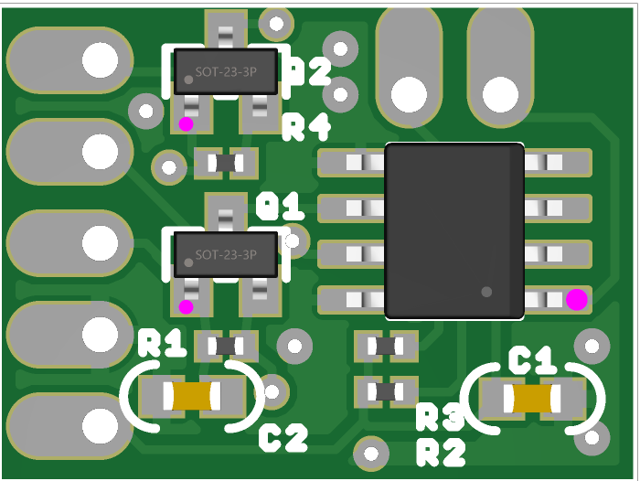

# Chirk Castle — DC Motor Driver H-Bridge (Quick Start)

**Designer/Manufacturer:** TerrainTronics.com  
**Board size:** ~18 mm × 14 mm (17.8 × 13.4 mm)  
**Connectors:** 0.1″ header holes or large solder-pads  
**Mounting holes:** None  
**Logic level:** 3.3–5 V tolerant (BSS138 level-shift)  
**Motor driver IC:** L9110S-HXY dual H-bridge (pre-assembled)  
**Protection:** No reverse-polarity / short / over-temp on board — protect externally  
**Status LEDs:** Optional (underside): VMOTOR present, VLOGIC present

---

## 1) Pinout (Top-View)

**Left 5-pin header (top → bottom):**  
1. **INB** (logic input)  
2. **INA** (logic input)  
3. **VLOGIC** (3.3–5 V)  
4. **DGND** (logic/motor ground)  
5. **VMOTOR** (motor supply, ≤ **6.5 V max**, 5 V recommended)

**Top 2-pin motor header (left → right):** **OB**, **OA**

> Tip: Keep **DGND** common to both logic and motor supplies.

---

## 2) Electrical limits (board rating)

- **VMOTOR:** up to **6.5 V max** (design limit). Recommend **5 V** and match to your motor.
- **Current:** up to **800 mA average**, **1.5 A peak** (IC capability). If current/heat is a concern,
  add an **external load switch, fuse, or PTC** in your system.
- **VLOGIC:** **3.3–5 V** (level shifters on board).

> The L9110S datasheet lists a wider voltage range; TerrainTronics rates this board to **≤ 6.5 V**.

---

## 3) Truth table (IA/IB → OA/OB)

| INA | INB | Motor | Notes |
|---:|---:|:------|:------|
| 1 | 0 | **Forward** (OA=H, OB=L) | Use PWM on **INA** or **INB** for speed |
| 0 | 1 | **Reverse** (OA=L, OB=H) | Use PWM on **INA** or **INB** for speed |
| 1 | 1 | **Brake** | Both outputs driven low (fast stop) |
| 0 | 0 | **Brake** | Both outputs driven low (fast stop) |

---

## 4) Wiring Examples

### A) Wemos D1 Mini (ESP8266, 3.3 V host)

- **VLOGIC** → **3.3 V** on D1 Mini  
- **DGND** → **GND**  
- **INA** → **D5 (GPIO14)** (PWM capable)  
- **INB** → **D6 (GPIO12)** (PWM capable)  
- **VMOTOR** → **5 V** supply (share **GND**)  
- **OB/OA** → Motor leads (left pad **OB**, right pad **OA**)

### B) Arduino UNO (5 V host)

- **VLOGIC** → **5 V**  
- **DGND** → **GND**  
- **INA** → **D5 (PWM)**  
- **INB** → **D6 (PWM)**  
- **VMOTOR** → **5 V** supply (share **GND**)  
- **OB/OA** → Motor leads (left **OB**, right **OA**)

> Swap motor leads or swap INA/INB if “forward” runs the wrong direction.

---

## 5) First-Power Checklist

1. With **VMOTOR** disconnected, power **VLOGIC** (3.3–5 V).  
2. Upload test code (set INA/INB both LOW → motor should **not** spin).  
3. Connect **VMOTOR 5 V**. Briefly set INA=HIGH, INB=LOW → **Forward**.  
4. Reverse (INA=LOW, INB=HIGH) → **Reverse**.  
5. Use PWM (e.g., 10–20 kHz) on one input to control speed.

---

## 6) Safety Notes

- **No onboard protection.** Avoid shorts & reverse polarity.  
- The IC can get **hot** at high currents or stall; limit duty-cycle or add a heatsink/airflow.  
- Consider **inline fuse/PTC** on VMOTOR.

---

**Product:** *Chirk Castle — DC Motor Driver H-Bridge* by **TerrainTronics.com**
